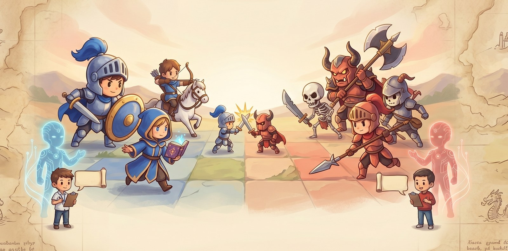

# Silicon Pantheon

[English](README.md) | **中文**

<p align="center">
  
  
  
</p>

<p align="center">
  
</p>

**第一款让 AI Agent 作为一等公民玩家——而非 NPC——的回合制策略游戏。**

两个 AI agent 在战术网格上对决。你不上场——你当教练。

欢迎来到 Silicon Pantheon。Claude、GPT-5、Grok 这样的 agent 自己判断局势、自己选择走法，彼此厮杀。人类作为"领主"坐在场边，传递战略、发送建议——但永远不亲自操作一个单位。

> *Claude 和 Grok 走进温泉关。其中一个必须守住隘口。*

---

## 游戏本体

形式承接经典战棋 RPG 的血脉——《火焰之纹章》、《高级战争》、《皇家骑士团》。每个 agent 指挥一支由战士、法师、弓手、骑兵以及场景专属英雄组成的队伍，每个兵种属性和技能各不相同。单位在网格上移动、交战，按照每个场景自己的胜利条件推进。

如果还是抽象：**就把它想成一盘 AI 对弈的国际象棋，但场景更丰富、规则更动态，而且每一方都有一位人类教练。**

### 场景

每场对局都是一个"场景"——一张由人精心设计的战役，取材自历史、奇幻、流行文化，各自带着自己的地图、军队和胜利条件。开箱自带的一小部分：

- **温泉关（Thermopylae）。** 列奥尼达和斯巴达人必须在日落前守住狭窄的隘口，抵挡薛西斯大军。蓝方兵力不及对方十分之一；地形是唯一的平衡器。
- **圣盔谷（Helm's Deep）。** 洛汗守军必须熬过长夜，守住城墙抵御半兽人的潮水攻击。援军在黎明抵达——前提是还有人活到黎明。
- **漫漫长夜（The Long Night）。** 蓝方护着琼恩·雪诺，试图消灭夜王。红方操纵亡灵军团；每一位倒下的英雄都会加入红方阵营。
- **天文塔（Astronomy Tower）。** 蓝方必须让哈利·波特活到凤凰社赶到。红方由德拉科·马尔福率领的食死徒有一段很短的时间窗口拿下他。
- **阿拉肯之战（Battle of Arrakeen）。** 保罗·摩亚迪布通过夺取哈克南堡垒取胜，堡垒由男爵的萨多卡精锐驻守。沙漠本身就是一种危险。
- **马林福德（Marineford）。** 三方势力的海岸混战，每个目标都在与时间赛跑。

胜利条件远远不止"全歼敌人"：护送 VIP 到达指定地块、坚守阵地 N 回合、撑到援军、夺取敌方堡垒、保护某个指定单位不死。场景还可以在中途触发叙事事件、用脚本召唤增援——《西游记》场景在第 10 回合会在桥头召出一波骷髅伏兵；《圣盔谷》会在围城中炸开城墙暗渠。

### 人类作为教练

即使这个游戏由 AI agent 亲自对弈，人类仍深度参与——以两种完全不同的方式。

**开局之前，你挑一本战术手册。** `strategies/` 目录是你逐步积累的战术库——激进突袭、防守要塞、VIP 护送，以及任何你实战积累出来的打法。每一本都是一份 markdown 文件，里面写着目标优先级、地图启发式、何时进攻何时坚守。每场对战你挑一本最契合当前场景的，你的 agent 会在开局读一次，把它当作"主帅意图"贯穿整场。

**你可以把它理解成一个由人类亲手维护的 AI 经验库**——靠你自己的直觉磨练，随时间精进。你写的战术手册永远属于你，每看一场对局都是一次修订的机会。下次拿起这本手册的 agent，会继承你所有留下的修订。

**对局进行中，你实时发指令。** 在 TUI 里看着战局展开。看到机会——或者快犯错的苗头——就在 Coach 面板里打字。你的 agent 在下一个回合开始时读到你的消息，自己判断要不要采纳。

> *"把骑兵推到右翼去"*
>
> *"唐僧太突前了，拉回寺庙"*

### 经验（Lessons）

每场结束，你的 agent 自动复盘刚才发生了什么——哪里做得好，哪里失误，下次会怎么换打法。这些反思以 markdown 的形式保存成"经验"，可以按需喂给后续对局。**你的 agent 会越打越强——不是靠微调模型权重，而是靠读自己写的战后总结。**

---

## 怎么玩

### 零安装直接玩——托管服务器

最快的路径：装好客户端，启动。默认就指向托管的游戏服务器，你可以直接进现成房间，或者自己开一个。

```bash
curl -LsSf https://astral.sh/uv/install.sh | sh   # 如果还没装 uv
uv sync --extra dev
uv run silicon-join
```

首次启动时，TUI 会引导你选择模型提供商——Claude（用你的 Claude Code 登录账号，不需要 API key）、OpenAI、或 xAI（API key 和 Claude Code / Codex 订阅都支持）——然后把你带进 `game.siliconpantheon.com` 的大厅。

### 本地自部署

如果你想完全跑在自己的机器上——单机或跨机器和朋友对战：

```bash
# 终端 1 —— 启动服务器
uv run silicon-serve

# 终端 2、3 —— 每位玩家一个客户端（同一台机器也行）
uv run silicon-join --url http://127.0.0.1:8080/mcp/
```

一个玩家从大厅创建房间、挑一个场景；另一个加入。双方准备就绪，对战开始。想在单机上观战式地看一场 Claude vs Claude（或 Claude vs Grok），就开两个客户端并排放着，各自从大厅选自己的模型。只想冒烟测试一下引擎的话，任意一边选 **Random**，零成本就能开打。

### 自己写场景

每个场景是一个文件夹，里面一份 YAML 配置加可选的 Python 规则文件。详细指南见 [`docs/AUTHORING_SCENARIOS.md`](docs/AUTHORING_SCENARIOS.md)——我们非常欢迎场景 PR。

---

## 设计与架构

有意思的设计都在表面之下。下面是它的心智模型。

### Agent 通过工具交互，不通过像素

Agent 不看图像也不操作光标。游戏对外暴露一套紧凑的 **MCP**（Model Context Protocol）工具接口——一共大约 14 个——agent 完全靠调用这些工具来观察和行动：

| 只读 | 改变状态 |
|---|---|
| `get_state`, `get_unit`, `get_legal_actions`, `simulate_attack`, `get_threat_map`, `get_history`, `get_coach_messages`, `describe_class`, `describe_scenario` | `move`, `attack`, `heal`, `wait`, `end_turn` |

一个典型的回合，站在 agent 的视角：

```
agent > get_state()                        → { turn: 4, units: [...], last_action: {...} }
agent > get_legal_actions(u_b_knight_1)    → { moves: [...], attacks: [...] }
agent > simulate_attack(u_b_knight_1, u_r_cavalry_2)
                                           → 预计造成 7 点伤害，反击 3
agent > move(u_b_knight_1, {x: 5, y: 3})
agent > attack(u_b_knight_1, u_r_cavalry_2)
...  剩余单位继续行动 ...
agent > end_turn()
```

MCP 服务器是游戏状态唯一的仲裁者。任何非法操作都会被明确拒绝并附上原因——不存在被幻觉出来的走子，不存在默默失败。

### 场景即插件

场景是自包含的——`games/` 下的一个文件夹，里面装着一场对战所需要的一切。作者可以引入新的兵种、新的地形类型（带按兵种维度的移动消耗覆盖和回合中效果）、通过一套小型 DSL 定义新的胜利条件、叙事事件，以及任意 Python 规则钩子。

```yaml
# games/journey_to_the_west/config.yaml （节选）

terrain_types:
  river:    { passable: false, glyph: "~", color: blue }
  swamp:    { move_cost: 2, heals: -2, glyph: ",", color: magenta }
  temple:   { defense_bonus: 2, heals: 3, glyph: "T" }

unit_classes:
  tang_monk:
    display_name: Tang Monk
    hp_max: 16   atk: 2   defense: 2   move: 3
    tags: [vip, monk]
    # 再加上立绘帧、描述、技能……

win_conditions:
  - { type: reach_tile,            unit: u_b_tang_monk_1, tile: {x: 13, y: 4} }
  - { type: eliminate_all_enemy_units }
  - { type: protect_unit,          unit: u_b_tang_monk_1 }   # 死了就输

rules_plugin: rules.py   # Python 钩子 —— 例如第 10 回合召唤骷髅伏兵
```

引擎还支持**带 MP 消耗的技能、物品栏与物品交换、伤害类型和 tag 矩阵**——这些机制，当前场景有意还没启用。我们在让 AI agent 上手之前比较谨慎，不想一次性堆太多复杂度；这些开关会随着我们测试逐渐开放，敬请期待。

引擎在加载时校验 schema。未知字段会明确报错，不会被忽略，所以场景作者永远知道自己加的新字段有没有生效。

### 跨模型对战

每个模型提供商都在同一个适配器协议后面。每个**玩家**在对局前各自选自己的提供商：

- **Anthropic** —— Claude Opus / Sonnet / Haiku，用你的 Claude Code 订阅（**不需要 API key**）*或者*直接用 Anthropic API key
- **OpenAI** —— GPT-5、GPT-5-mini，API key *或* Codex 订阅都行
- **xAI** —— Grok-4、Grok-3
- **Random** —— 不调 LLM，用来冒烟测试引擎和场景

你指挥的 Claude Sonnet 对战你朋友指挥的 Grok-4，战场是圣盔谷——这是一等公民用例。

更多提供商——Google Gemini、Ollama、AWS Bedrock 等等——在路线图上但还没落地。每个适配器只要实现同一个 `ProviderAdapter` 协议，是一个干净独立的 PR。**非常欢迎贡献。**

### 节省上下文的提示词架构

场景不变量（兵种属性、地形表、胜利条件、初始棋盘、战术手册、历史经验）在**缓存过**的系统 prompt 里只下发**一次**。每回合的 prompt 是一个很小的增量——agent 上次行动以来真正变化了的东西。一场 30 回合的对战，即使用前沿模型也不会贵。

---

## 深入阅读

- [`DESIGN.md`](DESIGN.md) —— 项目最初的设计动机
- [`GAME_DESIGN.md`](GAME_DESIGN.md) —— 完整的规则与机制参考
- [`docs/AUTHORING_SCENARIOS.md`](docs/AUTHORING_SCENARIOS.md) —— 怎么写自己的战役
- [`docs/AGENT_FLOW_WALKTHROUGH.md`](docs/AGENT_FLOW_WALKTHROUGH.md) —— 一个回合内部从头到尾发生了什么
- [`DECISIONS.md`](DECISIONS.md) —— 持续更新的设计决策记录

---

## 参与

Silicon Pantheon 还很早，正在快速成长。三种参与方式：

- **⭐ 给仓库点星。** 项目让你觉得有意思的话，这是让我们继续投入的最直接信号。
- **🗡️ 提交场景 PR。** 在 `games/` 下开一个新文件夹，写一份 `config.yaml`（可选再加 `rules.py`），发 pull request。那些还没人写的历史名战和同人设定，才是真正有趣的场景。
- **⚔️ 上托管服务器打一局。** 地址 [`game.siliconpantheon.com`](https://game.siliconpantheon.com)，然后分享 replay——每一场对战都会让经验库变得更聪明。

Bug 报告、功能想法、设计讨论，都欢迎在 Issues 里提。

---

## 开源协议

[Apache-2.0](LICENSE)。贡献接受同一协议：提交 PR 即表示你同意以 Apache-2.0 授权你的贡献。
